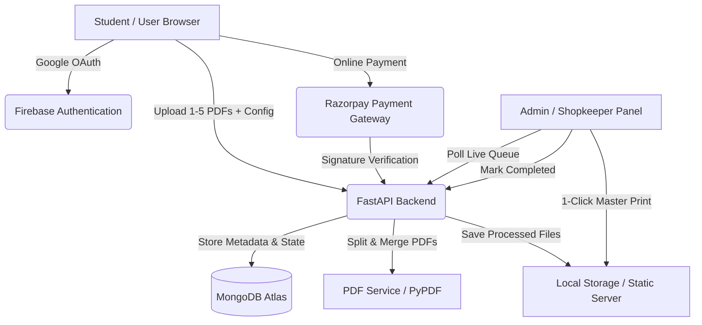

# 🖨️ Campus Print Web Application (Xerox Shop Automation)

A full-stack, token-based cloud printing platform designed for campus Xerox centres and college print shops. It eliminates physical queues and manual document sorting by allowing students to upload documents, configure granular print settings, pay online via Razorpay or offline at the counter, and collect prints using a unique 5-digit token.

---

## 🌟 Key Features

### 🎓 For Students
1. **Google OAuth Authentication**: Instant, secure sign-in via Google (Firebase Auth).
2. **Multi-PDF Upload (Up to 5 Files)**:
   - Upload up to 5 PDF files in a single job.
   - Client-side page count inspection via `pdfjs-dist`.
   - Remove individual files before submission.
3. **Granular Per-Document Configuration**:
   - **Paper Size**: Choose between **A4** and **A3** independently for each document.
   - **Color Page Range Selection**: Specify exact color pages (e.g. `1-3, 7, 12-15`), with remaining pages automatically processed as B&W.
   - **B&W Single vs Double-Sided**: Halves sheet count and pricing for double-sided B&W.
   - **Color Single vs Double-Sided**: Independent duplex options for color pages.
   - **Document Binding**: Optional binding toggle (+₹20 flat per copy).
   - **Copies Multiplier**: Specify required copies (1 to 50).
   - **"Apply Settings to All"**: One-click shortcut to propagate settings across all uploaded files.
4. **Live Dynamic Price Estimator**:
   - Real-time itemized breakdown per file and grand total calculation.
5. **Flexible Payment Modes**:
   - 💳 **Online Payment (Razorpay / UPI / QR / Card)**: Grants **Top Priority Queue Status** (paid jobs appear first on the admin screen).
   - 💵 **Pay at Counter (Offline Cash)**: Submit job immediately and pay cash at pickup.
6. **Payment Done & Token Confirmation Screen**:
   - Prominent **5-Digit Numeric Token** (e.g., `04821`).
   - Transaction receipt summary (Amount, Razorpay Txn ID, Order ID).
7. **Student Transaction & Order History**:
   - Dedicated **My Orders & History** tab.
   - Lifetime order metrics (Total Orders, Total Amount Paid, In Queue, Completed, Cancelled).
   - Filter tabs: `All`, `💳 Paid Online`, `💵 Pay at Counter`, `⏳ In Queue`, `✓ Completed`, `🚫 Cancelled`.
   - Click-to-copy token button to retrieve collection tokens at the counter anytime.
   - **Self-Service Order Cancellation**: Students can cancel any active pending print job with instant queue removal and confirmation modal.
   - Direct download links for original and split PDF files.

---

### 🏪 For Shopkeepers & Admins
1. **Real-Time Live Print Queue**:
   - Automatic polling feed (refreshes every 7s with auto-refresh toggle).
   - **FIFO Priority Queue**: Paid online orders appear first, sorted strictly by payment time (`paidAt` ascending).
   - Queue rank badges (`⚡ #1 in Queue`, `⚡ #2 in Queue`, etc.).
   - Queue filter tabs: `All Orders`, `⚡ Paid First`, `💵 Pay at Counter`.
2. **1-Click Master Quick-Print**:
   - **`Open ALL COLOR.pdf`**: Merges all color pages from all documents in the job into a single master PDF.
   - **`Open ALL BW.pdf`**: Merges all B&W pages from all documents in the job into a single master PDF.
   - Eliminates manual document splitting and sorting by the shopkeeper.
3. **5-Digit Token Search**:
   - Quick lookup search bar to retrieve any job by token.
4. **One-Click Order Completion**:
   - Mark jobs as printed & completed, automatically clearing them from the live queue.

---

## 💰 Pricing Matrix & Business Rules

| Paper Size | Color / B&W | Single-Sided | Double-Sided |
| :--- | :--- | :--- | :--- |
| **A4** | **B&W** | ₹2 / page | ₹2 / sheet (Half pricing: $\lceil \text{pages} / 2 \rceil \times \text{₹}2$) |
| **A4** | **Color** | ₹10 / page | ₹20 / sheet (2 pages $\times$ ₹10 = ₹20) |
| **A3** | **B&W** | ₹4 / page | ₹8 / sheet (2 pages $\times$ ₹4 = ₹8) |
| **A3** | **Color** | ₹15 / page | ₹30 / sheet (2 pages $\times$ ₹15 = ₹30) |

- **Binding**: ₹20 flat per copy.
- **Copies**: Subtotal $\times$ number of copies.
- **Tokens**: 5 numeric digits (`00000` to `99999`), guaranteed unique among active pending jobs.

---

## 🏗️ Architecture & Tech Stack



- **Frontend**: React 18, Vite, React Router v6, React Hot Toast, React Icons, pdfjs-dist, Razorpay Checkout SDK.
- **Backend**: Python 3.11+, FastAPI, Uvicorn, Motor (Async MongoDB), PyPDF, Razorpay Python SDK, Firebase Admin SDK.
- **Database**: MongoDB Atlas (`CampusXerox` database).
- **Authentication**: Firebase Auth (Google Sign-In).

---

## 📁 Project Structure

```
campus-print-app/
├── backend/
│   ├── api/
│   │   ├── dependencies.py       # Auth verification & DB session injection
│   │   └── routes/
│   │       ├── auth.py           # Admin verification route
│   │       ├── jobs.py           # Multi-file print submission & Live Queue
│   │       └── payments.py       # Razorpay order creation & signature verification
│   ├── core/
│   │   ├── config.py             # Dynamic settings & environment variables
│   │   └── security.py           # Firebase Admin SDK initialization
│   ├── models/
│   │   ├── job.py                # Pydantic schemas for multi-file print jobs
│   │   └── user.py               # User and admin check schemas
│   ├── services/
│   │   ├── db_service.py         # MongoDB async queries, FIFO queue sorting
│   │   ├── pdf_service.py        # PDF page count, split, and master merge
│   │   └── storage_service.py    # Local file saving & path resolution
│   ├── uploads/                  # Generated split and merged PDFs
│   ├── .env                      # Backend credentials & configuration
│   ├── firebase-service-account.json
│   ├── main.py                   # FastAPI entrypoint
│   └── requirements.txt          # Python dependencies
│
├── frontend/
│   ├── src/
│   │   ├── components/
│   │   │   ├── FileUploader.jsx       # Multi-file drag-and-drop uploader
│   │   │   ├── Navbar.jsx             # Top navigation & user profile
│   │   │   ├── PriceCard.jsx          # Live multi-document price breakdown
│   │   │   ├── ProtectedRoute.jsx     # Route protection & role guarding
│   │   │   └── TransactionHistory.jsx # Student order & payment history
│   │   ├── context/
│   │   │   └── AuthContext.jsx        # Firebase auth context provider
│   │   ├── pages/
│   │   │   ├── AdminView.jsx          # Live Print Queue & Master 1-Click Print
│   │   │   ├── Login.jsx              # Google sign-in page
│   │   │   └── StudentView.jsx        # Document config & Razorpay checkout
│   │   ├── services/
│   │   │   ├── api.js                 # Axios instance with auth token interceptor
│   │   │   └── firebaseConfig.js      # Firebase client SDK initialization
│   │   ├── utils/
│   │   │   └── calculators.js         # Multi-file pricing calculation logic
│   │   ├── App.jsx                    # Route definitions
│   │   ├── index.css                  # Modern responsive design styles
│   │   └── main.jsx                   # React root mount
│   ├── .env                           # Frontend environment variables
│   ├── index.html                     # HTML root with Razorpay checkout script
│   ├── package.json                   # Node.js dependencies
│   └── vite.config.js                 # Vite configuration
└── README.md
```

---

## ⚙️ Environment Configuration

### 1. Backend Configuration (`backend/.env`)

```env
# MongoDB Atlas Connection URI
MONGO_URI=mongodb+srv://<username>:<password>@<cluster>.mongodb.net/?appName=Xerox
DB_NAME=CampusXerox

# Firebase Admin SDK Service Account JSON Path
FIREBASE_CREDENTIALS_PATH=./firebase-service-account.json
FIREBASE_STORAGE_BUCKET=your_project.appspot.com

# Comma-separated list of Shopkeeper / Admin email addresses
ADMIN_EMAILS=your_email@gmail.com

# Razorpay API Credentials (from Razorpay Dashboard → Account & Settings → API Keys)
RAZORPAY_KEY_ID=rzp_test_XXXXXXXXXXXXXXXX
RAZORPAY_KEY_SECRET=YYYYYYYYYYYYYYYYYYYYYYYY
```

### 2. Frontend Configuration (`frontend/.env`)

```env
# Firebase Web App Credentials (from Firebase Console → Project Settings)
VITE_FIREBASE_API_KEY=your_api_key
VITE_FIREBASE_AUTH_DOMAIN=your_project.firebaseapp.com
VITE_FIREBASE_PROJECT_ID=your_project_id
VITE_FIREBASE_STORAGE_BUCKET=your_project.firebasestorage.app
VITE_FIREBASE_MESSAGING_SENDER_ID=your_sender_id
VITE_FIREBASE_APP_ID=your_app_id
VITE_FIREBASE_MEASUREMENT_ID=your_measurement_id

# Backend API Base URL
VITE_API_URL=http://localhost:8000

# Razorpay Key ID for Frontend Checkout
VITE_RAZORPAY_KEY_ID=rzp_test_XXXXXXXXXXXXXXXX
```

---

## 🚀 Step-by-Step Installation & Running Guide

### Prerequisites
- **Python 3.11+** installed
- **Node.js 18+** & **npm** installed
- **MongoDB Atlas** database cluster
- **Firebase Project** with Google Authentication enabled

---

### Step 1: Set Up Backend
1. Open a terminal and navigate to `backend/`:
   ```bash
   cd backend
   ```
2. Create and activate a Python virtual environment:
   ```bash
   python -m venv venv
   # On Windows PowerShell:
   .\venv\Scripts\Activate.ps1
   # On macOS/Linux:
   source venv/bin/activate
   ```
3. Install dependencies:
   ```bash
   pip install -r requirements.txt
   ```
4. Verify your `.env` and `firebase-service-account.json` are present in `backend/`.
5. Start the backend development server:
   ```bash
   uvicorn main:app --reload --port 8000
   ```
   The API documentation will be available at `http://localhost:8000/docs`.

---

### Step 2: Set Up Frontend
1. Open a second terminal and navigate to `frontend/`:
   ```bash
   cd frontend
   ```
2. Install dependencies:
   ```bash
   npm install
   ```
3. Start the Vite development server:
   ```bash
   npm run dev
   ```
4. Open your browser at `http://localhost:3000`.

---

## 🔌 API Endpoints Summary

| Method | Endpoint | Description | Access |
| :--- | :--- | :--- | :--- |
| `GET` | `/api/auth/verify-admin` | Check if current user is an admin | Authenticated |
| `POST` | `/api/jobs` | Submit multi-file print job & calculate total | Authenticated |
| `GET` | `/api/jobs/queue` | Live incoming print queue (FIFO sorted, Paid first) | Admin |
| `GET` | `/api/jobs/my-history` | Student print history & transaction receipts | Authenticated |
| `GET` | `/api/jobs/{token}` | Lookup job breakdown & downloads by 5-digit token | Authenticated |
| `PATCH` | `/api/jobs/{token}/cancel` | Cancel active print order (only if pending) | Authenticated (Owner) |
| `PATCH` | `/api/jobs/{token}/complete` | Mark job as printed & remove from queue | Admin Only |
| `POST` | `/api/payment/create-order` | Create Razorpay order for print job | Authenticated |
| `POST` | `/api/payment/verify` | Verify Razorpay payment signature & mark paid | Authenticated |

---

## 🛡️ Security Best Practices
- **Firebase Token Verification**: All API calls are authenticated using Firebase ID Tokens passed via the `Authorization: Bearer <token>` header.
- **Role-Based Authorization**: Admin-only routes (`/admin`, `PATCH /complete`, `GET /queue`) verify the user's email server-side against `ADMIN_EMAILS`.
- **Cryptographic Signature Verification**: Online payments are verified server-side using Razorpay's HMAC SHA256 signature utility before orders are prioritized.
- **Key Protection**: `RAZORPAY_KEY_SECRET` and service account keys are stored only in backend `.env` and are never exposed to the frontend.

---

## 📄 License
This project is licensed under the MIT License.

Developed by [Amit Ranjan](https://github.com/amitranjjan)

Permission is hereby granted, free of charge, to any person obtaining a copy...
